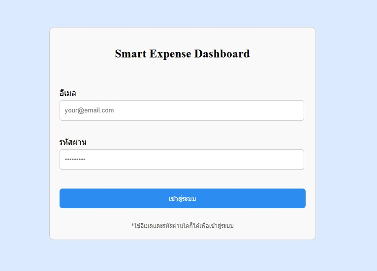
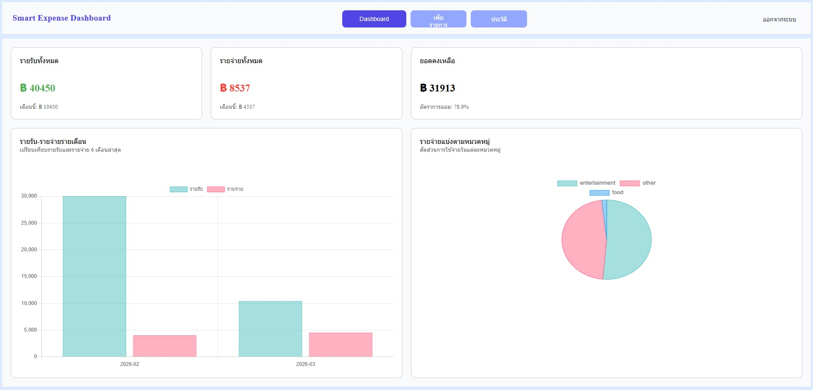
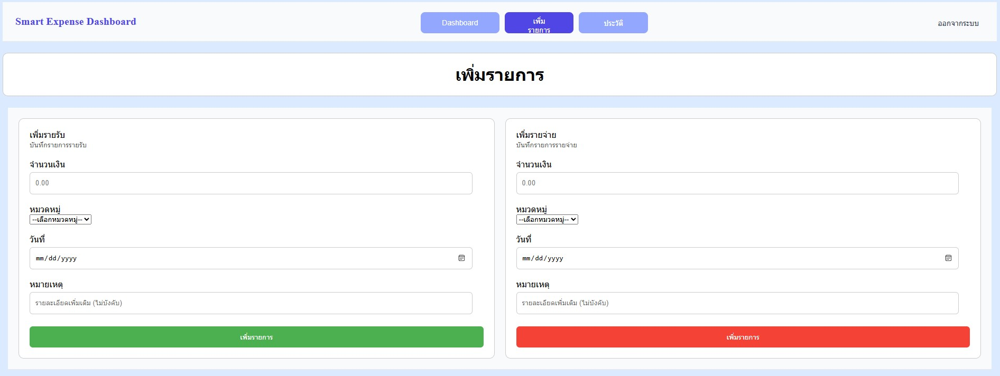
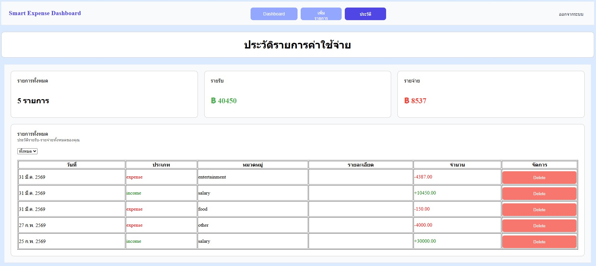

# 💸 Expense Tracker Web App

A full-stack web application for tracking income and expenses.

## 🚀 Live Demo
- Frontend: https://expense-tracker-git-main-pathmaker04s-projects.vercel.app
- Backend API: https://expense-tracker-production-e297.up.railway.app

## ✨ Features

- 🔐 User authentication (login/logout with session)
- 💰 Add income and expense
- 📊 Dashboard with summary and charts
- 📅 Monthly statistics
- 🗂 Transaction history
  
## 🛠 Tech Stack

Frontend:
- HTML, CSS, JavaScript
- Deployed on Vercel

Backend:
- Node.js + Express
- TypeScript
- Session-based authentication

Database:
- MySQL (Railway)

## 🏗 Architecture

- Frontend (Vercel) communicates with Backend (Railway)
- Backend connects to MySQL database (Railway)
- Uses REST API with session authentication (cookies)

## Picture

